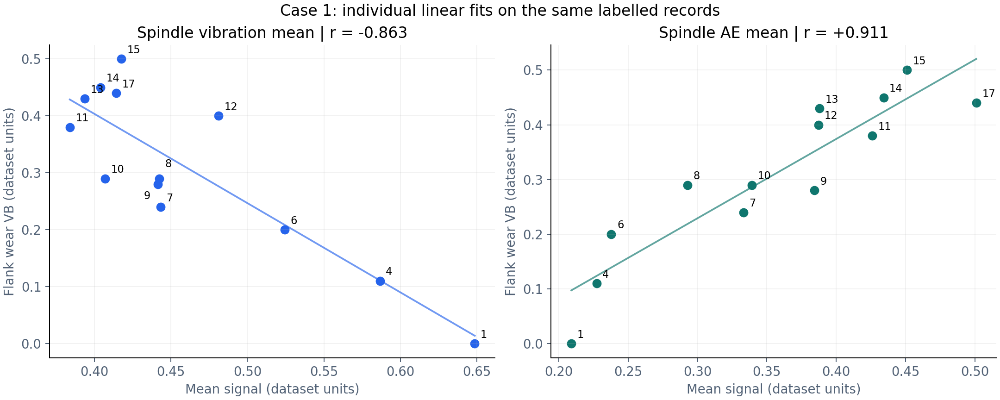
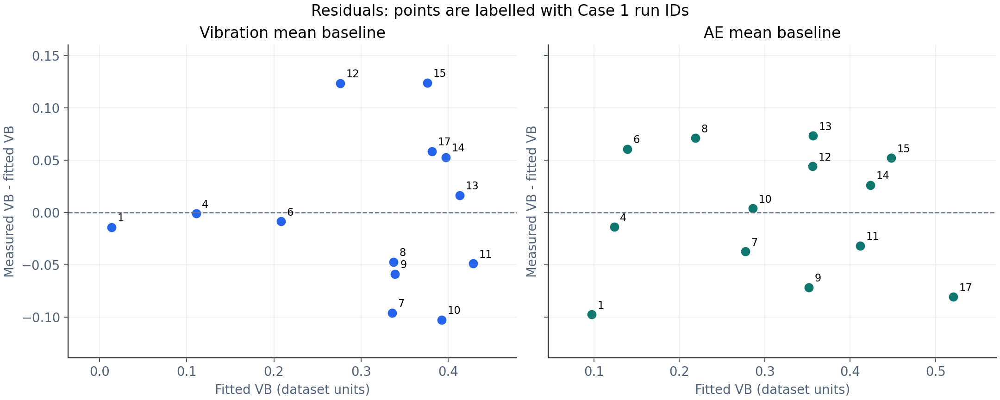

# NASA Milling: Sensor Features and Tool-Wear Baselines

An ongoing Python learning project exploring how spindle vibration and acoustic emission (AE) relate to measured flank wear (VB). By **Songjiang Cai**, Mechanical Engineering student at the University of Manchester.

**Current scope:** exploratory analysis of Case 1 and individual linear regression baselines. Independent validation and multivariable modelling are planned, not completed.



## Why this project?

I wanted to connect mechanical engineering with Python data analysis and explore a practical problem in smart manufacturing: estimating cutting-tool wear from sensor signals.

This stage focuses on understanding the data, selecting a consistent signal window, comparing simple features, and examining where a linear fit struggles.

## Data and provenance

The [NASA PCoE Milling dataset](https://www.nasa.gov/intelligent-systems-division/discovery-and-systems-health/pcoe/pcoe-data-set-repository/) records milling-insert wear under different experimental conditions. NASA credits the dataset to the UC Berkeley BEST Lab.

Dataset citation supplied by NASA: A. Agogino and K. Goebel (2007), BEST Lab, UC Berkeley, “Milling Data Set”, NASA Prognostics Data Repository, NASA Ames Research Center.

The source `mill.mat` used here contains 167 records. This release analyses the 13 Case 1 records with finite VB labels, including VB = 0. Source counts, the window definition and a file checksum are recorded in [provenance.json](results/provenance.json). The raw dataset is downloaded separately and is not bundled.

## What has been completed?

- Inspect Case 1 spindle vibration and AE signals.
- Exclude missing VB labels from supervised fitting while retaining the zero-wear record.
- Extract mean and standard deviation for both channels over the same signal window.
- Compare feature–VB correlations.
- Fit separate linear models using vibration mean, vibration standard deviation, and AE mean.
- Inspect signed residuals and mean absolute error (MAE); label points by actual Case 1 run IDs.

The publication edition reorganises the existing notebook, corrects confusing variable names and captions, and reproduces the saved results. See [the change notes](docs/PUBLICATION_NOTES.md).

## Method

The provisional window preserves the original notebook's mask:

```python
t = np.arange(9000) * 36 / 9000
mask = (t > 10) & (t < 25)
```

The physical time scale has not been verified against acquisition documentation. The publication code therefore uses equivalent sample fractions, and plots use sample indices. For a 9000-sample signal this selects zero-based indices 2501–6249. This window has not been validated for every case. Standard deviation uses `ddof=0`.

Each baseline fits:

```text
VB_hat = a × feature + b
residual = measured VB − VB_hat
MAE = mean(abs(residual))
```

The feature is the input and VB is the target. The models are fitted separately; no combined model is included yet.

## Current results

The values below are reproduced in [baseline_metrics.csv](results/baseline_metrics.csv), using [case1_features.csv](results/case1_features.csv). VB and signals retain dataset units; no calibrated physical units are assumed here.

| Single input feature | Pearson r with VB | In-sample MAE, in VB units |
| --- | ---: | ---: |
| Spindle vibration mean | −0.862647 | 0.057829 |
| Spindle vibration standard deviation | −0.833915 | 0.065038 |
| Spindle AE mean | +0.911328 | 0.051077 |

**These are fitting diagnostics. The same records are used to fit the models and calculate MAE. They are not independent test results.**



AE mean gives a lower fitting MAE than vibration mean in this case. The models have different residual patterns, which motivates investigating feature combinations. It does not yet demonstrate that the signals provide complementary predictive information on unseen runs.

All labelled records remain in the fit. An unusual signal or large residual is not, by itself, proof of a sensor fault or a reason to remove a record.

## Run the analysis

Install Python from [python.org](https://www.python.org/downloads/), extract or clone this repository, and open a terminal in the repository root. The numerical analysis was checked with Python 3.12.14, NumPy 2.3.5, SciPy 1.17.0, pandas 2.2.3 and Matplotlib 3.10.8; see [the validation note](docs/VALIDATION.md). Other installations have not been tested here.

On Windows, without activating the environment:

```powershell
py -m venv .venv
.\.venv\Scripts\python.exe -m pip install -r requirements.txt
.\.venv\Scripts\python.exe src\analysis.py
```

On macOS/Linux:

```bash
python3 -m venv .venv
.venv/bin/python -m pip install -r requirements.txt
.venv/bin/python src/analysis.py
```

Before running, download the Milling archive from NASA's linked repository, extract it, and place `mill.mat` in `data/`. Do not upload your raw data or virtual environment when publishing this package.

To use a different data location:

```powershell
.\.venv\Scripts\python.exe src\analysis.py --data "C:\path\to\mill.mat"
```

To open the notebook:

```powershell
.\.venv\Scripts\python.exe -m notebook
```

Open [notebooks/01_case1_exploration.ipynb](notebooks/01_case1_exploration.ipynb) and run the cells in order. The script and notebook reproduce the feature tables and figures. Saved notebook outputs and figures can also be read without running Python.

For beginner-friendly Windows, Colab and GitHub upload instructions, see [中文安装与发布指南](docs/SETUP_ZH.md).

## Repository guide

| Path | Purpose |
| --- | --- |
| `notebooks/01_case1_exploration.ipynb` | Explained analysis with saved outputs |
| `src/analysis.py` | Reproducible feature extraction, baseline fitting and plots |
| `data/README.md` | Where to obtain and place the raw data |
| `results/` | Feature, fit-metric, residual and provenance files |
| `figures/` | Actual data plots used in the README |
| `docs/` | Setup, publication notes, validation and learning log |

## Next steps

- Combine vibration mean and AE mean in a multivariable linear baseline.
- Test whether standard deviation adds information beyond the means.
- Compare against a simple baseline on held-out data, with a split suited to predicting later runs or new cases.
- Revisit windows and experimental conditions before extending to other cases.
- Consider machine-learning models after establishing a sound baseline and validation procedure.

These are planned tasks. No validated machine-learning or real-time monitoring system is claimed in this release.

## Personal reflection

<!-- Add your own reflection: what you expected, what surprised you, and what you would change. -->

## References and feedback

See [SOURCES.md](docs/SOURCES.md) for the dataset, documentation and repository-structure references. Feedback can be left through this repository's Issues page. Maintainer: Songjiang Cai.

Software licence: not selected for this draft. The NASA dataset is separately sourced; this package does not assign it a new licence.
